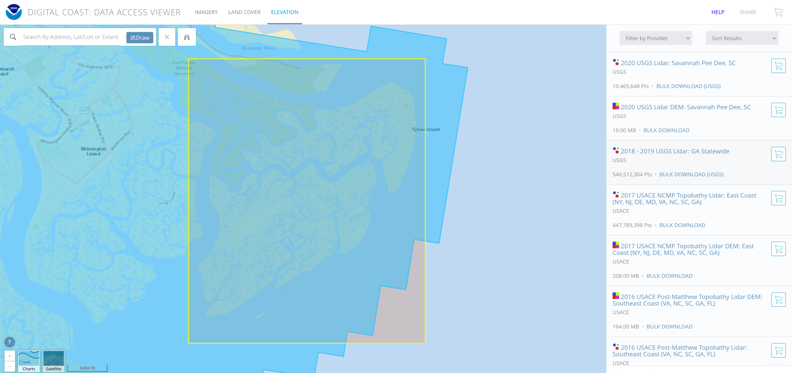

## Intent
This project is a foray into the world of LiDAR and data processing with Rust.

First things first, we need some data! Thankfully, NOAA has us covered with their awesome *Data Access Viewer*  
This tool allows us to get a dataset of public LiDAR data for any coastal region we are interested in exploring.

Let's check out this cool looking island off the coast of Georgia. 

Once we select a data source (from the toolbar on the right side of the screen) we can add this data to our cart and request the data for our selected region!  
If our request goes through, NOAA will email us a .zip file containing our decadent data.  

## LiDAR Data

The standard filetype for storing and distributing compressed LiDAR data is a **.laz** file. 
Since the region we selected was fairly large, NOAA provides this data to us in multiple **.laz** files, each containing a chunk of the relevant point cloud.

There are many applications which can read these .laz files natively, but since I'm relatively new to all this, let's decompress these with the cli tool *pdal* (check filegen.sh in the repository root)

We use *pdal* to translate the compressed **.laz** data into uncompressed **.las** files.  
Now we can read the (x,y,z) point data from the file, as well as some other fields.   
The standard format for a .las file is defined here: https://www.asprs.org/a/society/committees/standards/asprs_las_format_v12.pdf  

These are losslessly compressed files containing point cloud data. The uncompressed equivalent is a **.las** file.  

Plenty of open source tools exist for decompressing **.laz** files. I am using *pdal* for this project.  

The standard format for a .las file is defined here: https://www.asprs.org/a/society/committees/standards/asprs_las_format_v12.pdf  
Most importantly, the files contain (x,y,z) point data and a terrain classification.

